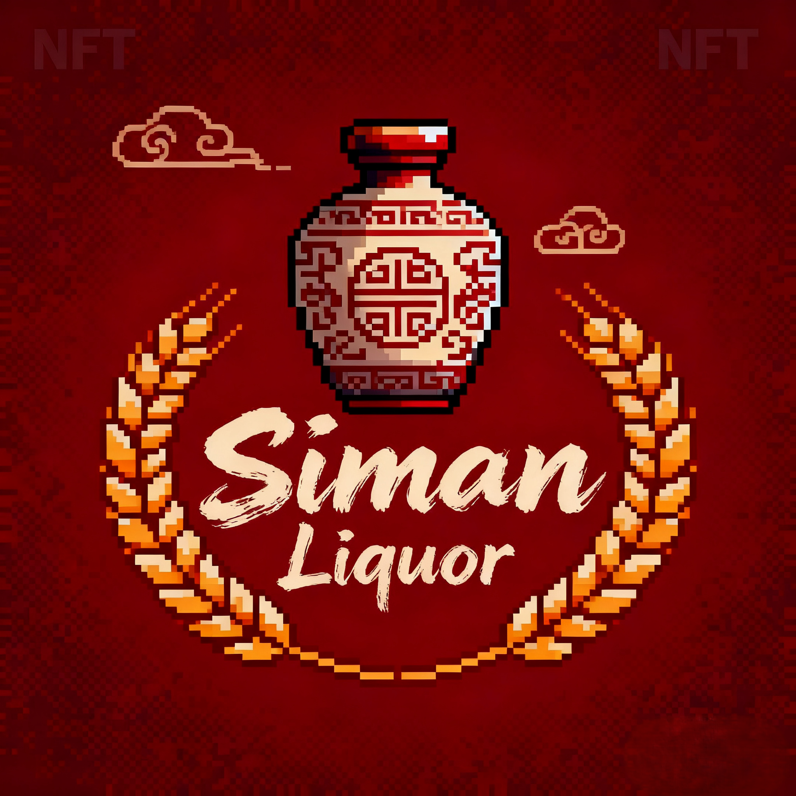

# 🍷 希漫酒业 (Siman Liquor) - Web3 NFT 神兽系列

<div align="center">



**传承千年酒文化，创新现代酿造技术**

[](https://vuejs.org/)
[](https://vitejs.dev/)
[](https://pinia.vuejs.org/)
[](https://sass-lang.com/)

[](https://github.com/blackvccat/siman-web3-nft)
[](https://github.com/blackvccat/siman-web3-nft)

</div>

## 🎯 项目概述

希漫酒业是一个融合传统中国酒文化与现代Web3技术的创新项目。以**中国红**为主题色彩，结合**东方Project幻想乡**的设计元素，打造独特的酒文化NFT体验。

### 🌟 核心特色

- 🐉 **希漫神兽系列**: 青龙、白虎、朱雀、玄武、黄龙五大神兽酒款
- 🎨 **中国红主题**: 传统中国红配色，体现酒文化底蕴
- 🌙 **日夜主题**: 白天人里间场景，夜晚旧地狱主题
- 🎵 **主题音乐**: 根据日夜主题自动切换背景音乐
- 🌐 **中英双语**: 完整的多语言支持
- 📱 **响应式设计**: 支持桌面端、平板、手机
- 🎠 **轮播展示**: 神兽系列产品轮播展示

## 🐉 希漫神兽系列

### 五大神兽酒款

| 神兽 | 方位 | 元素 | 酒款特色 | 稀有度 |
|------|------|------|----------|--------|
| 🐉 **青龙希漫** | 东方 | 木 | 清香型白酒，竹叶青、薄荷 | LEGENDARY |
| 🐅 **白虎希漫** | 西方 | 金 | 浓香型白酒，桂花、陈皮 | LEGENDARY |
| 🦅 **朱雀希漫** | 南方 | 火 | 玫瑰果酒，清甜果香 | LEGENDARY |
| 🐢 **玄武希漫** | 北方 | 水 | 酱香型白酒，枸杞、雪梨 | LEGENDARY |
| 🐲 **黄龙希漫** | 中央 | 土 | 浓香型白酒，红枣、黄芪 | MYTHIC |

### 文化内涵

每个神兽酒款都承载着深厚的中国传统文化：

- **五行理论**: 金、木、水、火、土五大元素
- **方位文化**: 东南西北中五个方位
- **季节象征**: 春夏秋冬四季轮回
- **皇权象征**: 黄龙代表中央皇权

## 🚀 快速开始

### 环境要求

- Node.js >= 16.0.0
- npm >= 8.0.0

### 安装与运行

```bash
# 克隆项目
git clone https://github.com/blackvccat/siman-web3-nft.git
cd siman-web3-nft

# 安装依赖
npm install

# 启动开发服务器
npm run dev

# 构建生产版本
npm run build
```

### 启动脚本

```bash
# Windows
start.bat

# Linux/Mac
chmod +x start.sh
./start.sh

# PowerShell
start.ps1
```

## 🏗️ 技术架构

### 技术栈

- **前端框架**: Vue.js 3 (Composition API)
- **构建工具**: Vite 5
- **状态管理**: Pinia 2
- **路由管理**: Vue Router 4
- **样式预处理**: SCSS/Sass
- **国际化**: 自定义 i18n 解决方案
- **PWA支持**: Service Worker + Manifest

### 项目结构

```
src/
├── components/          # 组件目录
│   ├── common/         # 通用组件
│   │   ├── MusicPlayer.vue      # 音乐播放器
│   │   ├── ThemeToggle.vue      # 主题切换
│   │   ├── TouhouCarousel.vue   # 神兽轮播组件
│   │   └── BackToTop.vue        # 返回顶部
│   └── layout/         # 布局组件
│       ├── AppHeader.vue        # 应用头部
│       └── AppFooter.vue        # 应用底部
├── views/              # 页面组件
│   ├── Home.vue        # 首页（神兽轮播）
│   ├── About.vue       # 关于我们
│   ├── OurStory.vue    # 我们的故事
│   ├── Shop.vue        # 商店
│   ├── LearnMore.vue   # 了解更多
│   └── Contact.vue     # 联系我们
├── stores/             # 状态管理
│   └── app.js          # 应用状态（主题、语言、音乐）
├── utils/              # 工具函数
│   └── i18n.js         # 国际化工具
└── assets/             # 静态资源
    └── styles/         # 样式文件
        ├── variables.scss       # SCSS变量
        ├── web3-background.scss # Web3背景效果
        └── main.scss            # 主样式
```

## 🎨 设计特色

### 中国红主题

- **主色调**: 中国红 (#DC2626)
- **辅助色**: 金色、橙色渐变
- **背景**: 淡红色渐变，营造温暖氛围
- **纹理**: 中国红网格纹理

### 东方Project元素

- **白天主题**: 人里间场景，竹林阳光效果
- **夜晚主题**: 旧地狱场景，地狱火焰效果
- **粒子系统**: 动态粒子效果
- **动画**: 流畅的过渡动画

### 响应式设计

- **移动端**: 480px以下
- **平板端**: 768px以下
- **桌面端**: 1200px以上
- **大屏端**: 1536px以上

## 🎵 音乐系统

### 主题音乐

- **白天音乐**: 人里间主题音乐
- **夜晚音乐**: 旧地狱主题音乐
- **自动切换**: 根据主题自动切换
- **全局播放**: 跨页面音乐播放

### 音乐控制

- **播放/暂停**: 一键控制
- **音量调节**: 滑块控制
- **静音功能**: 快速静音
- **状态保存**: 本地存储设置

## 🌐 国际化支持

### 支持语言

- **中文**: 完整的中文界面
- **英文**: 专业的英文翻译

### 翻译内容

- **导航菜单**: 所有导航项
- **页面内容**: 所有页面文本
- **神兽系列**: 神兽名称和描述
- **交互元素**: 按钮、提示等

## 📱 功能特性

### 核心功能

- ✅ **神兽轮播**: 五大神兽产品展示
- ✅ **主题切换**: 明亮/暗黑主题
- ✅ **音乐播放**: 主题音乐系统
- ✅ **语言切换**: 中英文切换
- ✅ **响应式**: 多设备适配
- ✅ **PWA**: 渐进式Web应用

### 高级功能

- ✅ **折叠式导航**: 创新的导航设计
- ✅ **Web3集成**: 钱包连接功能
- ✅ **状态管理**: Pinia状态管理
- ✅ **路由守卫**: 页面访问控制
- ✅ **懒加载**: 图片懒加载
- ✅ **缓存策略**: 智能缓存

## 🎯 页面展示

### 首页 (Home)
- **神兽轮播**: 五大神兽产品展示
- **产品网格**: 传统产品展示
- **背景效果**: 动态粒子系统

### 关于我们 (About)
- **公司介绍**: 希漫酒业历史
- **文化传承**: 酒文化内涵
- **技术特色**: 现代酿造技术

### 商店 (Shop)
- **NFT展示**: 数字藏品展示
- **购买规则**: NFT购买说明
- **产品详情**: 详细产品信息

### 我们的故事 (Our Story)
- **品牌故事**: 希漫酒业起源
- **传统工艺**: 酿酒工艺传承
- **文化内涵**: 酒文化深度

## 🚀 部署指南

### 开发环境

```bash
npm run dev
# 访问: http://localhost:3000
```

### 生产构建

```bash
npm run build
# 输出到: dist/ 目录
```

### 预览构建

```bash
npm run preview
# 预览生产构建结果
```

## 🔧 开发指南

### 代码规范

- **ESLint**: 代码质量检查
- **Prettier**: 代码格式化
- **Git**: 规范的提交信息
- **注释**: 详细的功能注释

### 性能优化

- **懒加载**: 路由和组件懒加载
- **图片优化**: WebP格式和懒加载
- **代码分割**: 按需加载
- **缓存策略**: 合理的缓存策略

## 🤝 贡献指南

1. **Fork**: Fork 项目到个人仓库
2. **分支**: 创建功能分支
3. **开发**: 按照规范进行开发
4. **测试**: 确保功能正常
5. **提交**: 提交 Pull Request

## 📄 许可证

本项目采用 MIT 许可证，详情请查看 LICENSE 文件。

## 📞 联系方式

- **项目**: 希漫酒业 (Siman Liquor)
- **技术**: Vue.js 3 + Vite + Pinia
- **版本**: 2.0.0
- **更新**: 2024年

## 🙏 致谢

感谢所有为这个项目做出贡献的开发者和设计师！

---

<div align="center">

**🍷 传承千年酒文化，创新现代酿造技术 🍷**

**🐉 希漫神兽系列，品味东方神韵 🐉**

[](https://github.com/blackvccat)
[](https://vuejs.org/)

</div>